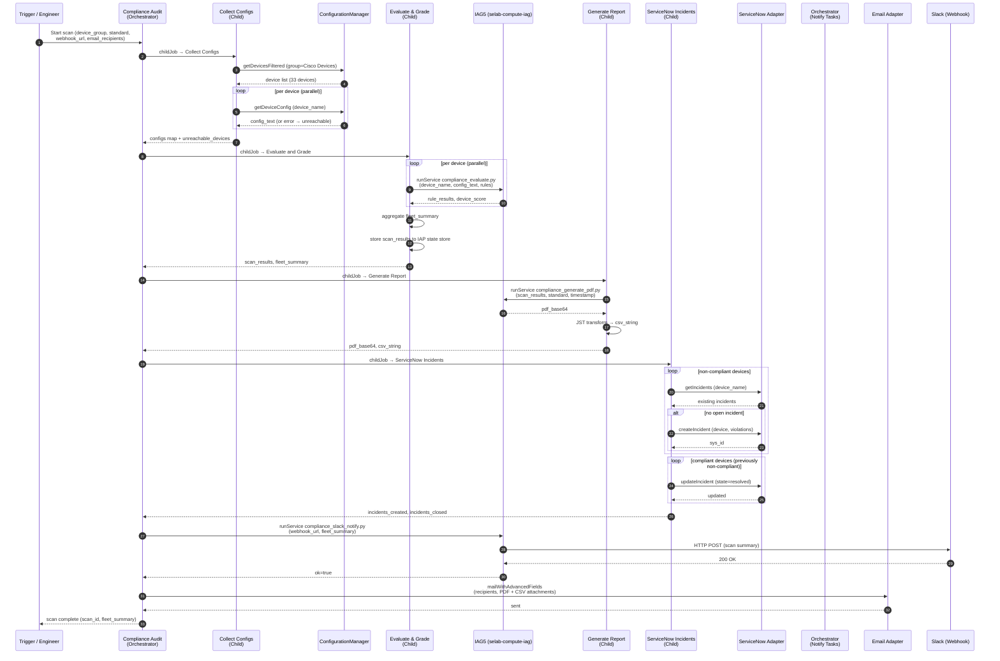

# Solution Design: Network Compliance Audit

**Stage:** Design — approved
**Platform:** https://platform-6-aidev.se.itential.io (IAP 6.2.0)
**Based on:** `customer-spec.md` (approved) + `feasibility.md` (approved)

---

## A. Environment Summary

IAP 6.2.0 cloud instance. ConfigurationManager holds 33 devices with a "Cisco Devices" group as the audit scope. MOP provides command template execution and config verification. Two IAG instances (`selab-compute-iag`) provide Python script execution for rule evaluation, PDF generation, and Slack notifications. ServiceNow adapter (v2.9.5) and email adapter (v4.7.12) are both RUNNING/ONLINE. OperationsManager handles scheduled triggers. WorkflowEngine orchestrates all phases.

---

## B. Requirements Resolution

```
┌───────────────────────────────────────────────┬────────┬─────────────────────────────────────────────────┐
│ Spec Requirement                              │ Status │ Resolution                                      │
├───────────────────────────────────────────────┼────────┼─────────────────────────────────────────────────┤
│ Pull running config via SSH (IOS/NX-OS)       │ ✓      │ ConfigurationManager.getDeviceConfig task        │
│ Evaluate config against pattern-based rules   │ ✓      │ IAG5 Python: compliance_evaluate.py              │
│ Score and aggregate results                   │ ✓      │ IAG5 Python: compliance_evaluate.py (returns      │
│                                               │        │ scores) + JST transformations for aggregation    │
│ Generate PDF reports                          │ ✓      │ IAG5 Python: compliance_generate_pdf.py          │
│                                               │        │ (reportlab/fpdf2) via selab-compute-iag          │
│ Generate CSV reports                          │ ✓      │ JST transformation → TemplateBuilder CSV output  │
│ Track compliance posture over time            │ ✓      │ Scan results stored as versioned JSON documents   │
│                                               │        │ in IAP state store (MongoDB-backed)              │
│ Apply config changes for remediation          │ ✓      │ ConfigurationManager.backUpDevice +               │
│                                               │        │ MOP.RunCommandTemplate + reuse                   │
│                                               │        │ "Push Configuration to Device" workflow          │
│ Schedule recurring scans                      │ ✓      │ OperationsManager cron trigger (weekly default)  │
│ ServiceNow — open/close incidents             │ ✓      │ ServiceNow adapter: createIncident,              │
│                                               │        │ updateIncident, getIncidents tasks               │
│ Slack — scan summary notifications            │ ✓      │ IAG5 Python: compliance_slack_notify.py          │
│                                               │        │ (webhook POST) via selab-compute-iag             │
│ Email — report delivery with PDF + CSV        │ ✓      │ email adapter: mailWithAdvancedFields task       │
└───────────────────────────────────────────────┴────────┴─────────────────────────────────────────────────┘
```

---

## C. Design Decisions

```
┌────────────────────────────────────┬──────────────────────────────────────────────────────────┐
│ Decision                           │ In This Environment                                      │
├────────────────────────────────────┼──────────────────────────────────────────────────────────┤
│ Missing capabilities               │ IAG5 Python scripts — engineer-approved                  │
│ Config collection method           │ ConfigurationManager.getDeviceConfig (SSH managed)        │
│ Rule evaluation engine             │ IAG5 Python (regex match/no-match, value comparison)      │
│ PDF generation                     │ IAG5 Python: compliance_generate_pdf.py (reportlab)       │
│ Slack delivery                     │ IAG5 Python: compliance_slack_notify.py (webhook POST)    │
│ Device scope                       │ "Cisco Devices" device group (OS field null in CMDB)      │
│ Standards storage                  │ JSON rules files in IAG5 service repo (GitLab)            │
│ Trend / history storage            │ IAP state store per scan run (scan_id + timestamp key)    │
│ Remediation gate                   │ Human approval via IAP form before any config push        │
│ ServiceNow ticket granularity      │ One incident per non-compliant device (not per violation) │
│ Build order                        │ Children first, orchestrator last                         │
└────────────────────────────────────┴──────────────────────────────────────────────────────────┘
```

---

## D. Modular Design

Each spec phase becomes an independently testable child workflow. The orchestrator is built last.

```
Spec Phase              → Component
─────────────────────────────────────────────────────────────────────
Collect Configs         → Child Workflow: Compliance - Collect Configs
Evaluate & Grade        → Child Workflow: Compliance - Evaluate and Grade
Generate Report         → Child Workflow: Compliance - Generate Report
ServiceNow Incidents    → Child Workflow: Compliance - ServiceNow Incidents
Remediate (optional)    → Child Workflow: Compliance - Remediate Device
Slack + Email notify    → Tasks in Orchestrator (no child needed)
Orchestrator            → Parent Workflow: Compliance Audit
Scheduling              → OperationsManager Trigger: Compliance Audit - Weekly
```

---

## E. Component Inventory

```
┌────┬──────────────────────────────────────────┬──────────────────────────┬────────┐
│ #  │ Component                                │ Type                     │ Action │
├────┼──────────────────────────────────────────┼──────────────────────────┼────────┤
│ 1  │ compliance_evaluate.py                   │ IAG5 Python Script       │ Build  │
│    │  Input: device_name, config_text,        │                          │        │
│    │  rules (JSON). Output: per-rule results, │                          │        │
│    │  device score (compliant/partial/fail),  │                          │        │
│    │  violation list with evidence lines      │                          │        │
├────┼──────────────────────────────────────────┼──────────────────────────┼────────┤
│ 2  │ compliance_generate_pdf.py               │ IAG5 Python Script       │ Build  │
│    │  Input: scan_results JSON, standard_name,│                          │        │
│    │  timestamp. Output: PDF as base64 string │                          │        │
├────┼──────────────────────────────────────────┼──────────────────────────┼────────┤
│ 3  │ compliance_slack_notify.py               │ IAG5 Python Script       │ Build  │
│    │  Input: webhook_url, scan summary JSON.  │                          │        │
│    │  Output: HTTP status                     │                          │        │
├────┼──────────────────────────────────────────┼──────────────────────────┼────────┤
│ 4  │ Get Running Config                       │ MOP Command Template     │ Build  │
│    │  Command: show running-config            │                          │        │
│    │  Platform: IOS/NX-OS                     │                          │        │
├────┼──────────────────────────────────────────┼──────────────────────────┼────────┤
│ 5  │ Compliance - Collect Configs             │ Child Workflow           │ Build  │
│    │  Gets device list from "Cisco Devices"   │                          │        │
│    │  group. Loops over each device. Calls    │                          │        │
│    │  getDeviceConfig per device. Returns     │                          │        │
│    │  map of device_name → config_text.       │                          │        │
│    │  Flags unreachable devices.              │                          │        │
├────┼──────────────────────────────────────────┼──────────────────────────┼────────┤
│ 6  │ Compliance - Evaluate and Grade          │ Child Workflow           │ Build  │
│    │  Accepts configs map + rules JSON.       │                          │        │
│    │  Loops over each device. Calls IAG5      │                          │        │
│    │  compliance_evaluate.py per device.      │                          │        │
│    │  Returns full results JSON with per-rule │                          │        │
│    │  pass/fail/N-A, device scores, fleet     │                          │        │
│    │  aggregates. Stores results to IAP state │                          │        │
│    │  store (keyed by scan_id + timestamp).   │                          │        │
├────┼──────────────────────────────────────────┼──────────────────────────┼────────┤
│ 7  │ Compliance - Generate Report             │ Child Workflow           │ Build  │
│    │  Accepts scan results JSON. Calls IAG5   │                          │        │
│    │  compliance_generate_pdf.py for PDF.     │                          │        │
│    │  Calls JST transform for CSV.            │                          │        │
│    │  Returns PDF (base64) + CSV string.      │                          │        │
├────┼──────────────────────────────────────────┼──────────────────────────┼────────┤
│ 8  │ Compliance - ServiceNow Incidents        │ Child Workflow           │ Build  │
│    │  Loops over non-compliant devices.       │                          │        │
│    │  Checks for existing open incident       │                          │        │
│    │  (getIncidents). Creates if none exists  │                          │        │
│    │  (createIncident). Loops over compliant  │                          │        │
│    │  devices. Closes any open incident       │                          │        │
│    │  (updateIncident → resolved).            │                          │        │
├────┼──────────────────────────────────────────┼──────────────────────────┼────────┤
│ 9  │ Compliance - Remediate Device            │ Child Workflow           │ Build  │
│    │  Input: device_name, corrective_config.  │                          │        │
│    │  Steps: backUpDevice → human approval    │                          │        │
│    │  form → RunCommandTemplate (apply fix)   │                          │        │
│    │  → re-run compliance_evaluate.py for     │                          │        │
│    │  affected rules → pass/fail result.      │                          │        │
│    │  Reuses "Push Configuration to Device"   │                          │        │
│    │  pattern.                                │                          │        │
├────┼──────────────────────────────────────────┼──────────────────────────┼────────┤
│ 10 │ Compliance Audit                         │ Parent Workflow          │ Build  │
│    │  Orchestrates children 5→6→7→8.          │                          │        │
│    │  After report: calls compliance_          │                          │        │
│    │  slack_notify.py (IAG5) for Slack.       │                          │        │
│    │  Calls mailWithAdvancedFields (email     │                          │        │
│    │  adapter) with PDF + CSV attached.       │                          │        │
│    │  Accepts: device_group, standard,        │                          │        │
│    │  slack_webhook_url, email_recipients,    │                          │        │
│    │  remediation_enabled (bool).             │                          │        │
├────┼──────────────────────────────────────────┼──────────────────────────┼────────┤
│ 11 │ Compliance Audit - Weekly                │ OperationsManager Trigger│ Build  │
│    │  Cron: 0 6 * * 1 (Monday 06:00 UTC).    │                          │        │
│    │  Triggers "Compliance Audit" workflow    │                          │        │
│    │  with default params (Cisco Devices,     │                          │        │
│    │  remediation_enabled: false).            │                          │        │
└────┴──────────────────────────────────────────┴──────────────────────────┴────────┘
```

---

## F. Implementation Plan

Build and test each child before assembling the orchestrator.

| Step | Component | Build Action | Test Method |
|------|-----------|-------------|-------------|
| 1 | `compliance_evaluate.py` | IAG5 Python script: load rules JSON, iterate rules, regex match/no-match against config text, return scored results | Run against a sample IOS config with known violations; verify pass/fail/N-A counts match expected |
| 2 | `compliance_generate_pdf.py` | IAG5 Python script: accept scan results JSON, render PDF with reportlab (exec summary + device table + violation detail) | Run with mock scan results; verify PDF is returned as valid base64 |
| 3 | `compliance_slack_notify.py` | IAG5 Python script: format summary message, POST to webhook URL | Run with test webhook; verify message appears in Slack channel |
| 4 | `Get Running Config` MOP template | Command template: `show running-config` for IOS platform | Run against one device in "Cisco Devices" group; verify config text returned |
| 5 | `Compliance - Collect Configs` | Child workflow: getDevicesFiltered (group=Cisco Devices) → loop → getDeviceConfig per device → collect map | Run on live platform; verify configs returned for reachable devices, unreachable flagged |
| 6 | `Compliance - Evaluate and Grade` | Child workflow: accept configs map + rules → loop → call compliance_evaluate.py per device → aggregate scores → store to state | Pass output from step 5; verify per-device scores and fleet aggregate |
| 7 | `Compliance - Generate Report` | Child workflow: call compliance_generate_pdf.py + JST CSV transform | Pass output from step 6; verify PDF (base64) and CSV produced |
| 8 | `Compliance - ServiceNow Incidents` | Child workflow: loop non-compliant → getIncidents → createIncident if none; loop compliant → updateIncident to resolved | Verify ticket created for flagged device; verify ticket closed when device passes |
| 9 | `Compliance - Remediate Device` | Child workflow: backUpDevice → approval form → RunCommandTemplate → re-evaluate | Test with remediation_enabled: true; verify approval gate blocks execution until approved |
| 10 | `Compliance Audit` (orchestrator) | Parent workflow: childJob 5→6→7→8 → Slack (IAG5) → Email | End-to-end test: trigger manually, verify all phases complete, report received, incidents created, Slack message posted |
| 11 | `Compliance Audit - Weekly` trigger | OperationsManager cron trigger pointing at orchestrator | Verify trigger definition; confirm next-run time is correct |

---

## H. Component Inputs / Outputs

| # | Component | Inputs | Outputs |
|---|-----------|--------|---------|
| 1 | `compliance_evaluate.py` | `device_name` (str), `config_text` (str), `rules` (JSON array) | `device_score` (compliant/partial/non_compliant), `rule_results` (array: rule_id, status, evidence), `violation_count`, `critical_violation_count` |
| 2 | `compliance_generate_pdf.py` | `scan_results` (JSON), `standard_name` (str), `standard_version` (str), `timestamp` (ISO str) | `pdf_base64` (str), `page_count` (int) |
| 3 | `compliance_slack_notify.py` | `webhook_url` (str), `summary` (JSON: posture_score, compliant_count, non_compliant_count, partial_count, standard_name, scan_id) | `status_code` (int), `ok` (bool) |
| 4 | `Get Running Config` (MOP) | `device` (str — device name), `device_group` (str, optional) | Raw command output: running config text |
| 5 | `Compliance - Collect Configs` | `device_group` (str, default: "Cisco Devices") | `configs` (object: device_name → config_text), `unreachable_devices` (array of str), `device_count` (int), `taskStatus` (str) |
| 6 | `Compliance - Evaluate and Grade` | `configs` (object), `rules` (JSON array), `standard_name` (str), `standard_version` (str), `scan_id` (str) | `scan_results` (JSON: per-device scores + rule results), `fleet_summary` (object: compliant/partial/non_compliant counts), `taskStatus` (str) |
| 7 | `Compliance - Generate Report` | `scan_results` (JSON), `standard_name` (str), `standard_version` (str), `scan_id` (str), `timestamp` (str) | `pdf_base64` (str), `csv_string` (str), `taskStatus` (str) |
| 8 | `Compliance - ServiceNow Incidents` | `scan_results` (JSON), `assignment_group` (str, default: "Network Team") | `incidents_created` (array: device + sys_id), `incidents_closed` (array: device + sys_id), `taskStatus` (str) |
| 9 | `Compliance - Remediate Device` | `device_name` (str), `corrective_config` (str), `rules` (JSON array), `standard_name` (str) | `remediation_status` (pass/fail), `backup_id` (str), `post_eval_results` (JSON), `taskStatus` (str) |
| 10 | `Compliance Audit` (orchestrator) | `device_group` (str), `standard` (str), `slack_webhook_url` (str), `email_recipients` (array), `remediation_enabled` (bool, default: false) | `scan_id` (str), `fleet_summary` (object), `pdf_base64` (str), `csv_string` (str), `incidents_created` (array) |
| 11 | `Compliance Audit - Weekly` (trigger) | Cron schedule (no runtime inputs — uses hardcoded defaults) | Starts `Compliance Audit` workflow job |

---

## I. Sequence Diagram



---

## J. Draw.io Architecture Diagram

See `architecture.drawio` in this directory for the visual component map. The diagram shows:
- **Trigger layer** — OperationsManager cron + on-demand entry point
- **Orchestration layer** — parent workflow sequencing all children
- **Execution layer** — child workflows and IAG5 Python scripts
- **Platform services** — ConfigurationManager, MOP
- **Integration layer** — ServiceNow, Email, Slack

---

## G. Acceptance Criteria → Tests

| AC | Test |
|----|------|
| 1. Standards defined with versioned, platform-aware rules | Rules JSON file in IAG5 repo contains CIS + Internal rules with platform=ios and version field; compliance_evaluate.py loads and applies correct ruleset |
| 2. Configs collected; unreachable devices flagged | Run Collect Configs child; inject one unreachable device; verify it appears in `unreachable_devices` output, not in configs map |
| 3. Per-rule pass/fail/not-applicable results | Run Evaluate child with known config; verify each rule produces exactly one of: pass, fail, not-applicable |
| 4. Device grading and fleet aggregation | Verify output contains `device_score` (compliant/partial/non-compliant) per device and `fleet_summary` by standard |
| 5. PDF + CSV reports with exec summary and device detail | Verify PDF contains executive summary page and per-device violation table; CSV contains one row per device with score and violation count |
| 6. Reports include timestamp, standard version, device list | Verify PDF header and CSV metadata row contain scan_id, timestamp, standard name + version, device count |
| 7. Compliance score history retained | Run two scans; verify both scan results exist in IAP state store under distinct scan_id keys |
| 8. Remediation with approval, backup, and re-evaluation | Trigger Remediate Device child; verify workflow pauses at approval form; approve; verify backup taken before config push; verify re-evaluation runs after |
| 9. On-demand and scheduled scans | Trigger orchestrator manually (on-demand); verify Weekly trigger exists in OperationsManager with correct cron |
| 10. ServiceNow incident per non-compliant device, closed when compliant | Verify createIncident called for non-compliant device; re-run with device now compliant; verify updateIncident called with state=resolved |
| 11. Slack message on scan completion | Verify Slack channel receives message with overall posture score and violation counts after orchestrator completes |
| 12. Email with PDF + CSV on scan completion | Verify email received by distribution list with two attachments (PDF + CSV) after orchestrator completes |
